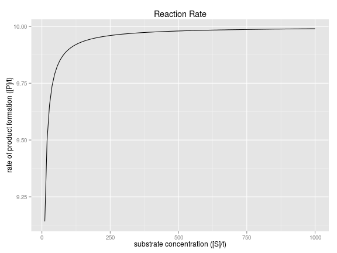

## Introduction

Enzymes are biological molecules that catalyze (increase the rates of) chemical reactions. [1]

Enzymes are studied by biologists all over the world for applications in:
- Understanding metabolism.
- Finding new drug targets (e.g cancer).
- Biotechnology application (e.g cleaning, drug discovery, biofuels).

---

## I'm a Dr, not a computer scientist

Michaelis and Menten established a set of mathematical equations in 1913 to calculate the reaction rates of enzyme catalysed reactions [2]. 

Biologists can make these calculations manually in order to understand the performance of enzymes in response to changes to their attributes:

$$\frac{dS}{dt} = -\text{k1}_f \cdot S \cdot E + \text{k1}_r \cdot ES$$

$$\frac{dE}{dt} = -\text{k1}_f \cdot S \cdot E + (\text{k1}_r + \text{k2}) \cdot ES$$

$$\frac{dES}{dt} = \text{k1}_f \cdot S \cdot E - \text{k1}_r + k2) \cdot ES$$

$$\frac{dP}{dt} = \text{k2} \cdot ES$$

Biologists don't want to spend their time with calculus and computers are much faster at it than humans.

--- .codefont

## There's an App for that!

I have created an app that calculates enzyme kinetics using state of the art solvers from the deSolve package[2], enabling life scientists to modify all of the appropriate enzyme properties and immediately visualize the reaction performance. Here's an example:

<div class="columns-2">

```r
require(deSolve)
require(ggplot2)
mm <- function(time,init,parms) {
  with(as.list(c(init, parms)), {
    dS <- -k1f * S * E + k1r * ES
    dE <- -k1f * S * E + (k1r + k2) * ES
    dES <- k1f * S * E - (k1r + k2) * ES
    dP <- k2 * ES
    vmax <- sum(k2 * sum(E + ES))
    v <- sum((vmax * S) / (km + S))
    
    return(list(c(dS,dE,dES,dP),v=v))
  })
}

parms = c(k1f=1.0, k1r=1.0,k2=1.0,km=1.0)
init = c(S=1000, E=10, ES=0, P=0)
exp.time = seq(1,100,1.0)
  
out <- as.data.frame(ode(y=init, times=exp.time, func = mm, parms=parms))

p1 <- ggplot(data=out, aes(x=S, y=v)) +
  geom_line() +
  xlab("substrate concentration ([S]/t)") +
  ylab("rate of product formation ([P]/t)") +
  ggtitle("Reaction Rate")
  
plot(p1)
```

 

---

## [The app is live and available on shiny.io](https://stevecheckley.shinyapps.io/shiny_mm)


()
### References
* [1] [Enzymes used in Industry. Boundless, 21st July 2015](https://www.boundless.com/microbiology/textbooks/boundless-microbiology-textbook/industrial-microbiology-17/microbial-products-in-the-health-industry-199/enzymes-used-in-industry-1004-5469/)
* [2] [Deichmann U. et al (2014). FEBS Journal, 281. 435-463.](http://onlinelibrary.wiley.com/doi/10.1111/febs.12598/pdf)
* [3] [Soetaert K. et al (2010). Journal of Statistical Software. 33:9, 1-24.](https://cran.r-project.org/web/packages/deSolve/index.html)


